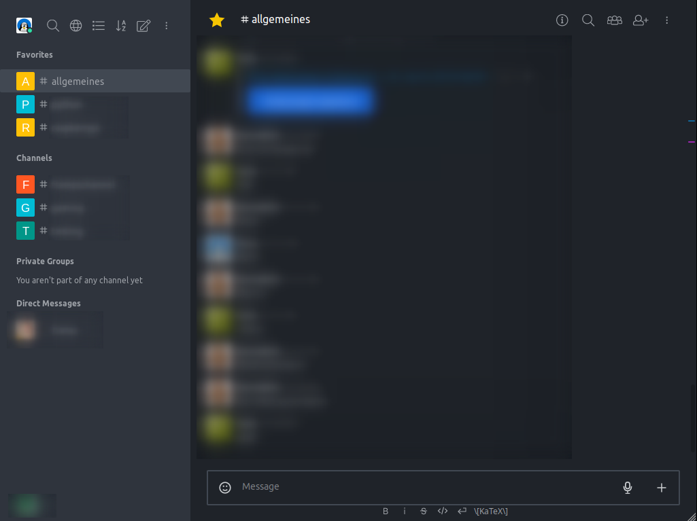
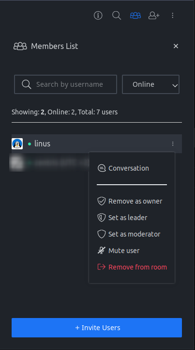
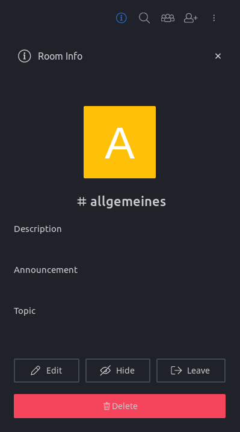

# rocketchat-dark

> Dark theme stylesheet for Rocket.Chat

## Why?

Because everything needs a dark theme. And because Rocket.Chat has no dark mode yet, except for the iOS app.

## Installation

You can either install this as a user in your browser or as an admin globally for your Rocket.Chat installation.

### Browser
- Install a Userstyle-Addon like Stylus ([Firefox](https://addons.mozilla.org/de/firefox/addon/styl-us/), [Chrome](https://chrome.google.com/webstore/detail/stylus/clngdbkpkpeebahjckkjfobafhncgmne))
- Create a new style and copy the content of [`style.css`](style.css) into it

Make sure to restrict the scope of the style to the domain of your Rocket.Chat installation.

### Rocket.Chat

- Go to **Administration → Layout → Custom CSS**
- Copy the content of [`style.css`](style.css) into it the **Custom CSS** field
- Click **Save changes** at the top

## Screenshots

  

## TODO

This theme is not finished yet. It's usable but the admin interface and other parts will remain light.
